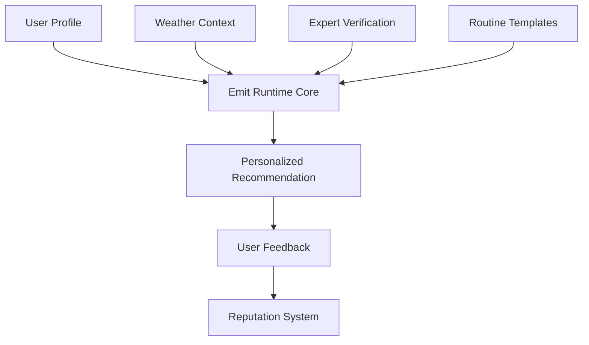

# Emit Runtime Protocol

## 🌟 Overview

Emit Runtime is a cutting-edge, decentralized personalization protocol built on the Stacks blockchain. By leveraging smart contract technology, Emit Runtime provides a robust framework for generating personalized recommendations with unprecedented transparency and user control.

## 🔬 Core Features

- User Profile Management
- Expert Credential Verification
- Dynamic Recommendation Generation
- Feedback and Reputation Tracking
- Weather-Adaptive Personalization

## 🚀 Technical Architecture

The protocol utilizes Clarity smart contracts to:
- Securely store and manage user profiles
- Validate expert credentials
- Generate context-aware recommendations
- Track and reward user interactions



## 🛠 Getting Started

### Prerequisites
- Clarinet
- Stacks Blockchain
- Node.js

### Installation
```bash
git clone https://github.com/yourusername/emit-runtime.git
cd emit-runtime
clarinet contract check
```

### Example Usage
```clarity
;; Register a user profile
(contract-call? .emit-runtime-core register-user 
    "combination" 
    (list "aging" "texture") 
    (list "anti-aging" "brightening"))

;; Generate a recommendation
(contract-call? .emit-runtime-core generate-recommendation 
    25 ;; temperature
    60 ;; humidity
    5  ;; UV index)
```

## 📦 Deployment

Deploy using Clarinet:
```bash
clarinet deployment generate
```

## 🧪 Testing
```bash
clarinet test
```

## 🤝 Contributing

1. Fork the repository
2. Create a feature branch
3. Commit your changes
4. Push and create a Pull Request

## 🔐 Security Considerations

- Validate all user inputs
- Use proper error handling
- Implement rate limiting for recommendations
- Ensure single-submission feedback mechanism
- Maintain separation of concerns

## 📄 License

MIT License

## 🌐 Ecosystem

Built for the decentralized future of personalized experiences.